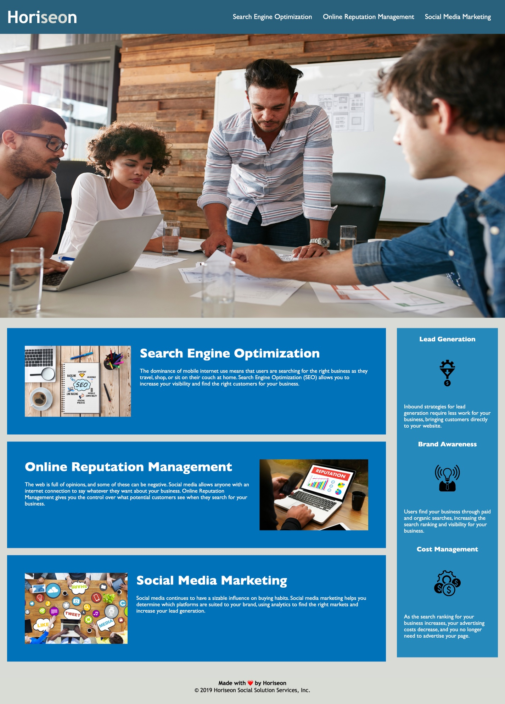

# Code Refactoring - Horiseon Marketing

## Description

The purpose of this project was to refactor the code of a fictional marketing agency's website. The overarching goal was to make the site more accessible. Horiseon (the fake marketing company) wanted the new code to follow accessibility standards in order to optimize their site for search engines.

## Acceptance Criteria

1. All elements in the HTML have semantic meaning.
2. The HTML elements follow a logical structure.
3. Each image contains a descriptive alt attribute.
4. The heading attributes fall in sequential order.
5. The title is concise and descriptive.

## Changes Made to Starter Code

The following is a brief list of changes made to the code to adhere to accessibility standards.

1. I changed a few elements in the HTML so that each element has semantic meaning. i.e. The div tags in the header section were changed to header tags.
2. The HTML elements already followed a logical structure in the starter code, though the tags were basically all divs rather than semantic tags. As mentioned above, this was changed.
3. I added descriptive alt attributes to each image and inspected the final product to make sure they all show up and are helpful. 
4. I altered one heading element within the footer from h2 to h4 so that all heading attributes fall in sequential order.
5. I changed the title from "Website" to something more meaningful, including key words to (ideally) boost SEO. 
6. I also added comments to each section to make the site and code more navigable for the viewer. 

## Mock-Up

